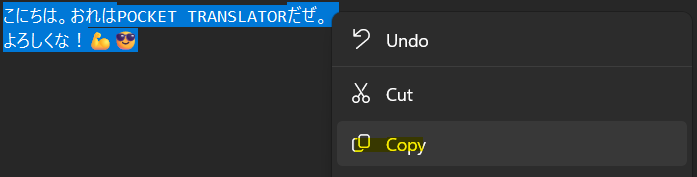
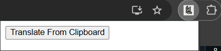
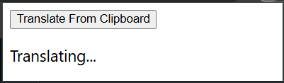
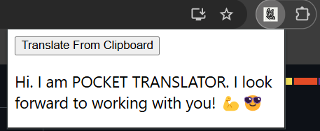

# POCKET TRANSLATOR

No more alt tabbing for your Jap <-> Eng translation needs!


  

## Installation

1. Clone the repository from https://github.com/sono-jugyoin/pocket-translator.git
	
 Type the following in cmd, powershell, or bash:
	```
	git clone https://github.com/sono-jugyoin/pocket-translator.git
	```

2. Install as a Chrome Extension
	1.	 Type `chrome://extensions` in the Chrome Web Browser URL
	2.	 Press `Load Unpacked` in the top right
	3.	 Head over to your cloned directory of `pocket-translator`
	4.	 Press `Select Folder` on the `extension` folder inside the `pocket-translator`
3. (Optional) Set up your keyboard shortcut
	1. Select `Keyboard Shortcuts` in the `chrome://extensions` left navigation pane
	2. Set the desired keyboard shortcut
		- Suggest to use `ctrl + space`

## How to Use
1. Copy the text you wish to translate
	- If text is in Japanese, it will be translated to English
	- If text is in English, it will be translated to Japanese

	
2. While in Chrome, press your keyboard shortcut or select the `extensions` button (found after the Chrome address bar)
	- A pop up will appear

	
3. Press `space` to translate your text or click the `Translate from Clipboard` button

	
4. Your translation will appear in the popup momentarily

	
